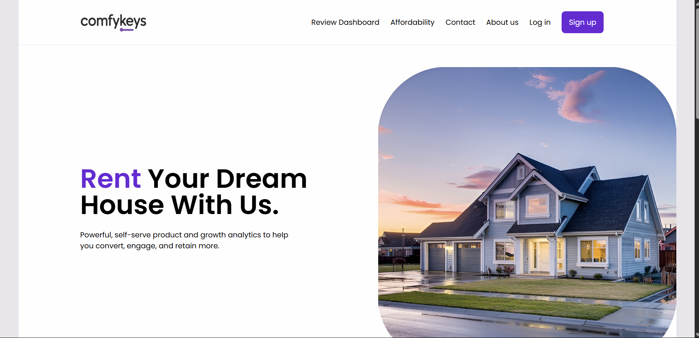
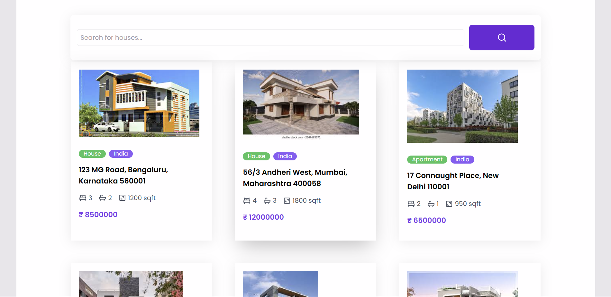
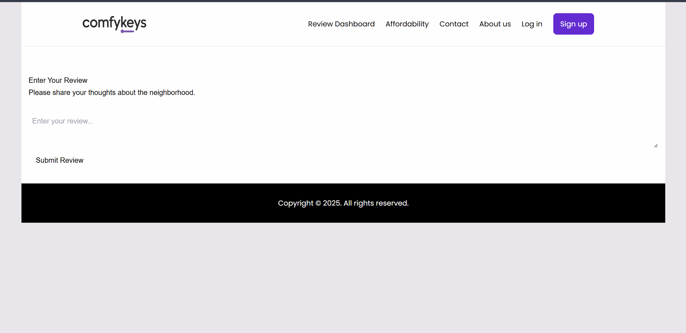

# ComfyKeys

> **ComfyKeys**: a vibrant ReactJS real‑estate app styled with Tailwind CSS and powered by a local `db.json` backend. Browse dynamic listings, sign up/log in, save favourites, manage properties, and contact agents—all in a lightweight, scalable package.

---

## 🚀 Demo & Screenshots

> Below screenshots showcase key pages. Replace image paths with your own `screenshots/` files.

**Homepage**



**Property Details**



**Dashboard / Profile**



---

## 📋 Table of Contents

1. [Features](#-features)
2. [Technology Stack](#-technology-stack)
3. [Project Structure](#-project-structure)
4. [Installation](#-installation)
5. [Usage](#-usage)
6. [Environment Variables](#-environment-variables)
7. [Contributing](#-contributing)
8. [License](#-license)

---

## 🔍 Features

- **Dynamic Listings**: Real‑time sorting, filtering by price, location, bedrooms, and more.
- **User Authentication**: Secure sign‑up and login flows with persistent sessions.
- **Favourites**: Save and revisit your preferred properties.
- **CRUD Operations**: Owners/admins can add, edit, and delete property listings via forms.
- **Contact Forms**: In‑app messaging to agents or owners; submissions stored in `db.json`.
- **Responsive Design**: Mobile‑first layout powered by Tailwind CSS utilities.
- **Client‑side Routing**: Seamless navigation using React Router.
- **Global State**: React Context API manages auth status, filters, and favourites.
- **Scalable Backend**: JSON‑Server simulates REST API—easy to swap for a real DB.

---

## 🛠️ Technology Stack

| Layer              | Technology           |
| ------------------ | -------------------- |
| **Frontend**       | ReactJS              |
| **Styling**        | Tailwind CSS         |
| **Routing**        | React Router         |
| **State**          | React Context API    |
| **Mock Backend**   | JSON‑Server (`db.json`)
| **HTTP Client**    | Fetch API / Axios    |

---

## 🗂️ Project Structure

```bash
project-root/
├─ client/
│  ├─ public/            # Static assets & index.html
│  ├─ src/
│  │  ├─ assets/         # Images, icons
│  │  ├─ components/     # Reusable UI (Banner, Header, Footer, HouseList, Search)
│  │  ├─ pages/          # Route pages (Home, Login, Signup, Dashboard, PropertyDetails, Contact, AboutUs, GetReview, WhatCanIfford)
│  │  ├─ App.js
│  │  ├─ data.js         # Sample data or service functions
│  │  ├─ index.js
│  │  └─ tailwind.config.js
│  ├─ package.json
│  └─ tailwind.config.js # Tailwind configuration
├─ server/               # JSON‑Server config & `db.json`
│  ├─ db.json            # Users, listings, messages
│  └─ package.json
└─ README.md             # This file
```

---

## ⚙️ Installation

1. **Clone the repo**
   ```bash
   git clone https://github.com/yourusername/comfykeys.git
   cd comfykeys
   ```

2. **Setup JSON‑Server**
   ```bash
   cd server
   npm install
   npm start            # runs at http://localhost:3001
   ```

3. **Setup Frontend**
   ```bash
   cd ../client
   npm install
   npm start            # runs at http://localhost:3000
   ```

---

## ▶️ Usage

- Visit `http://localhost:3000`
- Browse listings, apply filters, and view details.
- Register or log in to save favourites and send enquiries.
- As an owner/admin, navigate to the Dashboard to **Add**, **Edit**, or **Delete** listings.

---

## 🔧 Environment Variables

> None by default. If you replace JSON‑Server with a real API, add `.env` and configure API endpoints:

```env
REACT_APP_API_URL=http://localhost:3001
```

---


> Crafted with ♥ using React, Tailwind CSS & JSON‑Server. Feel free to ⭐ the project if you find it helpful!

